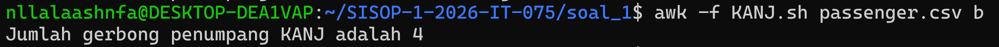
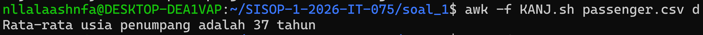
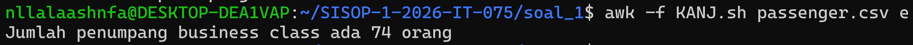
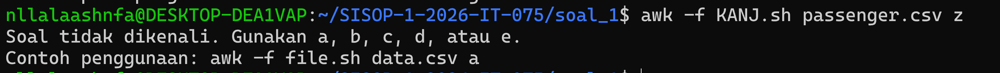

# Sisop-1-2026-IT-075

| Nama | NRP |
|--------------|-----|
| Nayla Aisha Hanifa | 5027241075 |

---

## Soal 1 - ARGO NGAWI JESGEJES

### Penjelasan

Script `KANJ.sh` dibuat menggunakan **AWK** untuk menganalisis data penumpang kereta dari file `passenger.csv`. Awk merupakan sebuah program yang bisa digunakan untuk mengambil catatan/record tertentu dalam sebuah file dan melakukan sebuah/beberapa operasi terhadap catatan/record tersebut. Script ini menerima argumen berupa opsi `a/b/c/d/e` untuk menampilkan informasi yang berbeda-beda tentang data penumpang. Jadi AWK itu seperti robot pemeriksa tiket yang berdiri di pintu keluar stasiun. Setiap ada penumpang lewat, robot ini bakal nyatet semua data mereka.

---

#### Format File passenger.csv
File `passenger.csv` berisi data penumpang dengan format kolom:
```
Nama Penumpang, Usia, Kursi Kelas, Gerbong
```
Contoh isi file:

| Nama Penumpang | Usia | Kursi Kelas | Gerbong |
|----|------|-----|-----|
| Budi Hartanto | 34 | Economy | Gerbong2 |

File ini isinya total ada 208 data nama penumpang berserta dengan usia, kursi kelas dan gerbongnya

---

#### Penjelasan Code KANJ.sh 

**1. Bagian BEGIN - Persiapan Sebelum Membaca File**
```awk
BEGIN {
    FS = ","
    option = ARGV[2]
    delete ARGV[2]
}
```
Bagian `BEGIN` dijalankan **sebelum** AWK mulai membaca file. Isinya:
- `FS = ","` 
Memberitahu AWK bahwa pemisah antar kolom adalah tanda koma (`,`). Jadi kalau si AWK liat koma, dia tau itu batas antara Nama, Usia, dan Kelas.
- `option = ARGV[2]` 
Menyimpan argumen ketiga yang diketik pengguna (a/b/c/d/e) ke dalam variabel `option`. Contoh: saat mengetik `awk -f KANJ.sh passenger.csv a`, maka `ARGV[2]` berisi huruf `a`
- `delete ARGV[2]` 
Menghapus argumen tersebut agar AWK tidak salah mengira huruf `a/b/c/d/e` sebagai nama file yang ingin dibaca
- `Kenapa ARGV[2]?`
ARGV (Argument Vector) itu adalah daftar catatan milik AWK yang mencatat semua kata yang diketik di terminal.
AWK mulai menghitung isi catatan dari angka 0.
`Kenapa Pakai [2]?`
Contoh kita mau menjalankan perintahkan AWK
```
awk -f KANJ.sh passenger.csv a
```
Jadi catatan (ARGV) milik AWK:
ARGV[0] = awk (Nama programnya)
ARGV[1] = passenger.csv (File data yang mau dibaca)
ARGV[2] = a (Huruf opsi yang diketik tadi)
Jadi, alasan pakai ARGV[2] adalah karena si huruf a berada di urutan ketiga (indeks ke 2) dari yang diketik di terminal.

**2. Bagian NR == 1 - Melewati Baris Header**
```awk
NR == 1 { next }
```
- `NR` adalah nomor baris total yang sudah dibaca AWK
- `NR == 1` artinya "jika ini adalah baris pertama"
- `{ next }` artinya "lewati baris ini, jangan diproses"
- Ini penting karena baris pertama CSV adalah header (`Nama Penumpang,Usia,Kursi Kelas,Gerbong`) bukan data penumpang, jadi tidak boleh ikut dihitung

**3. Bagian Pengolahan Data - Membaca Setiap Baris**
Jadi dicode saya menjelaskan bahwa 
``` 
kolom: $1=Nama, $2=Usia, $3=Kursi Kelas, $4=Gerbong
```
```awk
{
    count_passenger++
    carriages[$4] = 1

    if ($2 > max_age) {
        max_age = $2
        oldest_name = $1
    }

    total_age += $2

    if ($3 == "Business") {
        business++
    }
}
```
Bagian ini dijalankan untuk **setiap baris data** penumpang. Penjelasan tiap baris:

- `count_passenger++` Setiap kali membaca satu baris data penumpang, akan menambahkan penghitung sebanyak 1. Untuk menghitung total penumpang sesuai permintaan soal
- `carriages[$4] = 1` Menyimpan nama gerbong (kolom ke-4) ke dalam array bernama `carriages`. Karena array tidak bisa menyimpan duplikat key yang sama, maka gerbong yang sama hanya akan tersimpan sekali. Ini digunakan untuk menghitung berapa gerbong **unik** (supaya tidak ada yang terhitung dua kali). Jadi AWK akan menghitung ada berapa gerbong yang berhasil dibuat. Meskipun ada 100 orang dari "Gerbong1", sistem akan tetap membaca cuma satu. Jadi, total_carriage akan memberikan hasil jumlah gerbong yang berbeda saja (unik).
- `if ($2 > max_age)` Membandingkan usia penumpang saat ini (`$2` = kolom usia) dengan usia maksimum yang sudah ditemukan sebelumnya. Jika usia penumpang ini lebih besar
  - `max_age = $2` 
  Update usia maksimum
  - `oldest_name = $1` simpan nama penumpang ini sebagai yang tertua. Kalau penumpang selanjutnya bukan usia tertua maka sistem akan cuek aja dan lanjut ke penumpang berikutnya
- `total_age += $2` Menjumlahkan semua usia penumpang. Jadi sistem kerjanya tuh setiap ada penumpang lewat, sistem bakal nambahin umur mereka ke dalam satu tempat besar bernama `total_age`. Gunanya code ini untuk nantinya total ini dibagi jumlah penumpang untuk mendapatkan rata-rata usia semua penumpang.
- `if ($3 == "Business")` Mengecek tiket apakah kolom ke-3 (Kursi Kelas) tertuliskan "Business". Jika iya, sistem akan menambahkan perhitungan `business`. Tetapi jika tulisannya 'Economy' atau yang lain sistem nggak bakal masukin data itu ke perhitungan business tersebut. Ini untuk menghitung penumpang Business Class.

**4. Bagian END - Menampilkan Hasil Sesuai Opsi**
```awk
END {
    if (option == "a") {
        print "Jumlah seluruh penumpang KANJ adalah " count_passenger " orang"
    }
    else if (option == "b") {
        for (c in carriages) total_carriage++
        print "Jumlah gerbong penumpang KANJ adalah " total_carriage
    }
    else if (option == "c") {
        print oldest_name " adalah penumpang kereta tertua dengan usia " max_age " tahun"
    }
    else if (option == "d") {
        avg = int(total_age / count_passenger)
        print "Rata-rata usia penumpang adalah " avg " tahun"
    }
    else if (option == "e") {
        print "Jumlah penumpang business class ada " business " orang"
    }
    else {
        print "Soal tidak dikenali. Gunakan a, b, c, d, atau e."
        print "Contoh penggunaan: awk -f file.sh data.csv a"
    }
}
```
Bagian `END` dijalankan setelah semua baris selesai dibaca. Di sini menampilkan hasil sesuai opsi yang dipilih:

- **Opsi a** 
Langsung cetak variabel `count_passenger` yang sudah berisi total penumpang

- **Opsi b** 
Sebelum mencetak, lakukan dulu `for (c in carriages) total_carriage++` yaitu menghitung berapa banyak key yang ada di array `carriages` (= berapa gerbong unik) yang tadi sudah dihitung dan tercatat. Kemudian cetak hasilnya

- **Opsi c** 
Cetak nama penumpang tertua (`oldest_name`) dan usianya (`max_age`) yang sudah tersimpan saat memproses data

- **Opsi d** 
Hitung rata-rata dengan `total_age / count_passenger`, lalu bungkus dengan `int()` agar hasilnya berupa bilangan bulat tanpa desimal (misal 30.7 tahun menjadi 30 tahun). Kemudian cetak hasilnya

- **Opsi e** 
Cetak variabel `business` yang berisi jumlah penumpang Business Class

- **Selain opsi a-e** 
Cetak pesan error yang menjelaskan opsi yang valid beserta contoh cara penggunaan yang benar

---

#### Cara Menjalankan Script
```bash
awk -f KANJ.sh passenger.csv a   # Menampilkan total penumpang
awk -f KANJ.sh passenger.csv b   # Menampilkan jumlah gerbong unik
awk -f KANJ.sh passenger.csv c   # Menampilkan penumpang tertua
awk -f KANJ.sh passenger.csv d   # Menampilkan rata-rata usia
awk -f KANJ.sh passenger.csv e   # Menampilkan jumlah penumpang Business Class
awk -f KANJ.sh passenger.csv z   # Contoh opsi tidak dikenal → muncul pesan error
```
---

### Output

- `OPSI A`

- `OPSI B`

- `OPSI C`

- `OPSI D`

- `OPSI E`

- `OPSI SELAIN A-E`


---

### Kendala
Belum terbiasa untuk menggunakan ataupun mengoperasikan linux 

---
---
## Soal 2 - EKSPEDISI PESUGIHAN GUNUNG KAWI

### Penjelasan

Soal 2 untuk membantu Mas Amba menemukan lokasi pusaka yang tersembunyi di Gunung Kawi. Paman dari Mas Amba meninggalkan sebuah peta rahasia berbentuk file PDF. Di dalam peta tersebut, ada petunjuk rahasia yang mengarah ke sebuah tempat penyimpanan data koordinat. Caranya adalah dengan mengunduh peta ekspedisi dalam format PDF, menemukan link tersembunyi di dalamnya, meng-clone repository dari link tersebut, kemudian mengolah data koordinat yang ada untuk menemukan titik pusat lokasi pusaka.

---

#### Langkah 1 - Mendapatkan File PDF dan Clone Repository

File `peta-ekspedisi-amba.pdf` disimpan ke dalam folder `ekspedisi/`. Di dalam file PDF tersebut terdapat sebuah URL tersembunyi yang mengarah ke repository GitHub berisi data koordinat lokasi ekspedisi pamannya mas amba.

URL yang ditemukan di dalam PDF:
```
https://github.com/pocongcyber77/peta-gunung-kawi.git
```

Repository tersebut di-clone ke dalam folder `ekspedisi/` menggunakan perintah:
```bash
git clone https://github.com/pocongcyber77/peta-gunung-kawi.git
```

Perintah `git clone` akan mengunduh seluruh isi repository. Hasilnya adalah folder `peta-gunung-kawi/` yang berisi file `gsxtrack.json` dengan data koordinat titik-titik lokasi ekspedisi.

---

#### Langkah 2 - Memahami Isi gsxtrack.json

File `gsxtrack.json` berisi data titik-titik lokasi dalam format JSON dengan field-field seperti `id`, `site_name`, `latitude`, dan `longitude`. Data ini masih dalam format mentah JSON yang sulit dibaca langsung, sehingga perlu di-parse menjadi format yang lebih rapi.

---

#### Langkah 3 - parserkoordinat.sh

Script `parserkoordinat.sh` bertugas membaca file `gsxtrack.json` dan mengekstrak data penting ke dalam file `titik-penting.txt` dengan format yang lebih rapi dan mudah dibaca.
```bash
#!/bin/bash

grep -E '"id"|"site_name"|"latitude"|"longitude"' gsxtrack.json | \
awk '
/"id"/ { id=$0; gsub(/.*: "|",?$/, "", id) }
/"site_name"/ { name=$0; gsub(/.*: "|",?$/, "", name) }
/"latitude"/ { lat=$0; gsub(/.*: |,?$/, "", lat) }
/"longitude"/ { lon=$0; gsub(/.*: |,?$/, "", lon); print id","name","lat","lon }
' > titik-penting.txt

echo "Parsing selesai! Hasil disimpan di titik-penting.txt"
cat titik-penting.txt
```

**Penjelasan baris per baris:**

- `grep -E '"id"|"site_name"|"latitude"|"longitude"' gsxtrack.json` → Perintah `grep` digunakan untuk menyaring baris-baris dari file JSON yang hanya mengandung kata `id`, `site_name`, `latitude`, atau `longitude`. Baris lain yang tidak relevan akan diabaikan. Tanda `|` artinya "atau"

- `| \` → Tanda pipe (`|`) meneruskan hasil `grep` tadi ke perintah berikutnya yaitu `awk`. Tanda `\` berarti perintah masih berlanjut ke baris berikutnya

- Di dalam `awk`:
  - `/"id"/ { id=$0; gsub(/.*: "|",?$/, "", id) }` → Jika baris mengandung kata `"id"`, simpan seluruh baris ke variabel `id`, lalu gunakan `gsub` untuk menghapus semua karakter yang tidak perlu (seperti tanda kutip, titik dua, koma) sehingga hanya tersisa nilai id-nya saja (contoh: `node_001`)
  
  - `/"site_name"/ { name=$0; gsub(/.*: "|",?$/, "", name) }` → Sama seperti di atas tapi untuk nama lokasi. Hasilnya contohnya: `Titik Berak Paman Mas Mba`
  
  - `/"latitude"/ { lat=$0; gsub(/.*: |,?$/, "", lat) }` → Sama untuk latitude. Hasilnya contohnya: `-7.920000`
  
  - `/"longitude"/ { lon=$0; gsub(/.*: |,?$/, "", lon); print id","name","lat","lon }` → Sama untuk longitude. Setelah longitude berhasil diambil, langsung cetak semua data dalam satu baris dengan format `id,nama,latitude,longitude`

- `> titik-penting.txt` → Menyimpan semua output ke file `titik-penting.txt`

- `echo "Parsing selesai!..."` → Menampilkan pesan bahwa proses selesai

- `cat titik-penting.txt` → Menampilkan isi file hasil parsing ke layar

**Hasil file titik-penting.txt:**
```
node_001,Titik Berak Paman Mas Mba,-7.920000,112.450000
node_002,Basecamp Mas Fuad,-7.920000,112.468100
node_003,Gerbang Dimensi Keputih,-7.937960,112.468100
node_004,Tembok Ratapan Keputih,-7.937960,112.450000
```

---

#### Langkah 4 - nemupusaka.sh

Script `nemupusaka.sh` bertugas menghitung koordinat titik pusat dari keempat titik lokasi yang membentuk persegi. Titik pusat inilah yang merupakan lokasi pusaka yang dicari Mas Amba.
```bash
#!/bin/bash

lat1=$(awk -F',' 'NR==1{print $3}' titik-penting.txt)
lon1=$(awk -F',' 'NR==1{print $4}' titik-penting.txt)
lat3=$(awk -F',' 'NR==3{print $3}' titik-penting.txt)
lon3=$(awk -F',' 'NR==3{print $4}' titik-penting.txt)

lat_tengah=$(awk "BEGIN {printf \"%.6f\", ($lat1 + $lat3) / 2}")
lon_tengah=$(awk "BEGIN {printf \"%.6f\", ($lon1 + $lon3) / 2}")

echo "Koordinat pusat: $lat_tengah, $lon_tengah"
echo "$lat_tengah, $lon_tengah" > posisipusaka.txt
```

**Penjelasan baris per baris:**

- `lat1=$(awk -F',' 'NR==1{print $3}' titik-penting.txt)` → Mengambil nilai latitude dari baris pertama (node_001) di file titik-penting.txt:
  - `-F','` → pemisah kolom adalah koma
  - `NR==1` → hanya baris pertama
  - `{print $3}` → cetak kolom ke-3 (latitude)
  - Hasilnya disimpan ke variabel `lat1`

- `lon1=$(awk -F',' 'NR==1{print $4}' titik-penting.txt)` → Sama seperti di atas tapi mengambil longitude (kolom ke-4) dari baris pertama, disimpan ke `lon1`

- `lat3` dan `lon3` → Sama seperti di atas tapi mengambil dari baris ke-3 (node_003) yang merupakan titik diagonal dari node_001

- `lat_tengah=$(awk "BEGIN {printf \"%.6f\", ($lat1 + $lat3) / 2}")` → Menghitung rata-rata latitude dengan rumus `(lat1 + lat3) / 2`. Menggunakan `printf "%.6f"` agar hasil ditampilkan dengan 6 angka di belakang koma

- `lon_tengah` → Sama seperti di atas tapi untuk longitude

- `echo "Koordinat pusat: ..."` → Menampilkan hasil koordinat pusat ke layar

- `echo "$lat_tengah, $lon_tengah" > posisipusaka.txt` → Menyimpan koordinat pusat ke file `posisipusaka.txt`

**Mengapa menggunakan node_001 dan node_003?**

Berdasarkan petunjuk dari Sang Dukun, keempat titik koordinat membentuk sebuah **persegi**. Lokasi pusaka berada tepat di tengah persegi tersebut. Untuk mencari titik tengah persegi, cukup hitung rata-rata dari dua titik yang saling **berhadapan secara diagonal** yaitu node_001 (pojok kiri atas) dan node_003 (pojok kanan bawah).

Rumusnya:
```
Titik Tengah = ((lat1 + lat3) / 2 , (lon1 + lon3) / 2)
```

**Hasil posisipusaka.txt:**
```
-7.928980, 112.459050
```

---

#### Cara Menjalankan Script
```bash
# Jalankan parser koordinat terlebih dahulu
bash parserkoordinat.sh

# Jalankan pencari lokasi pusaka
chmod +x nemupusaka.sh
./nemupusaka.sh
```

### Output


### Kendala
Belum terbiasa untuk menggunakan ataupun mengoperasikan linux 
